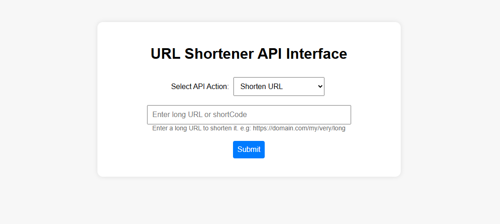
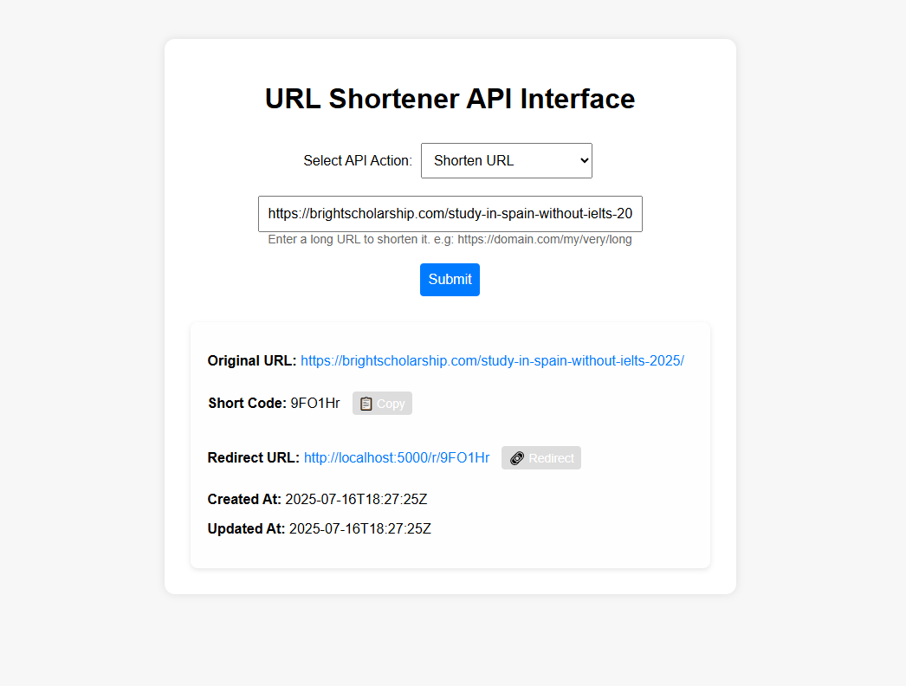
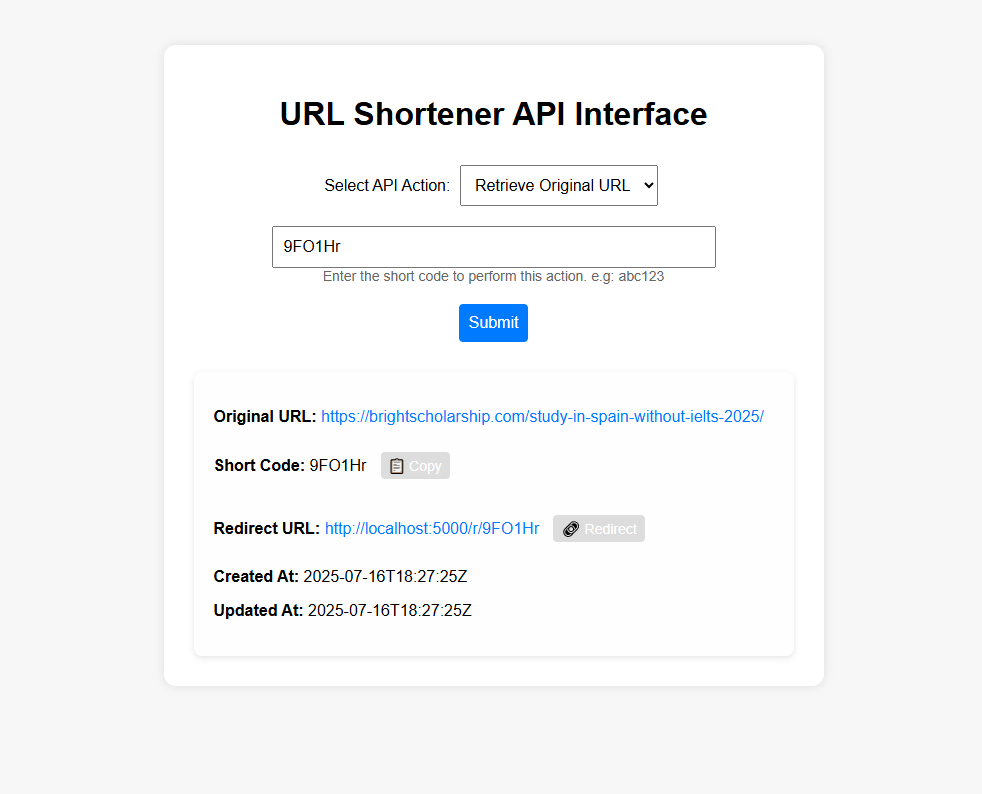
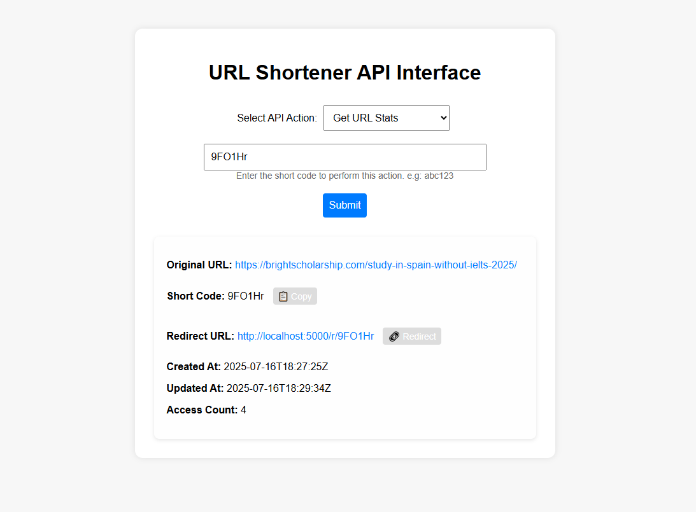
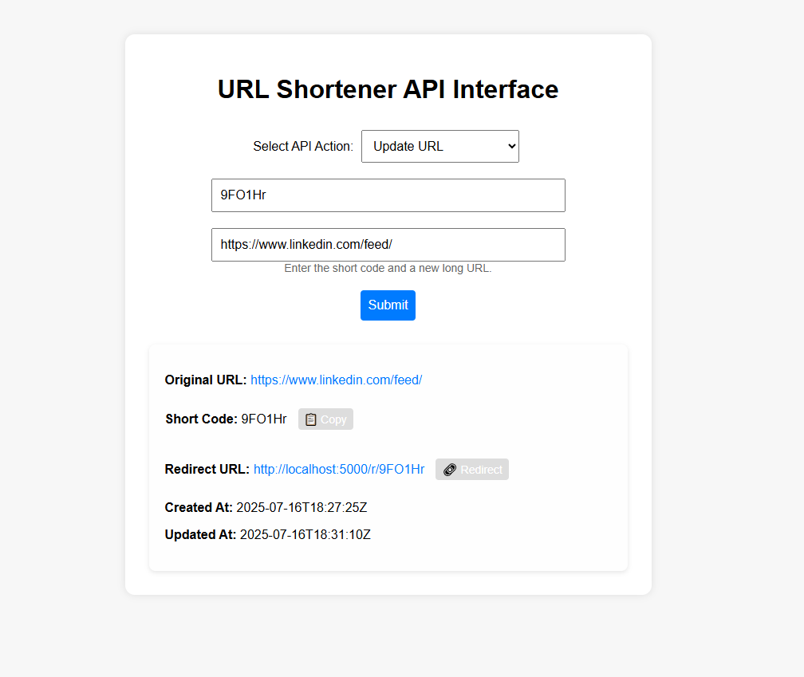
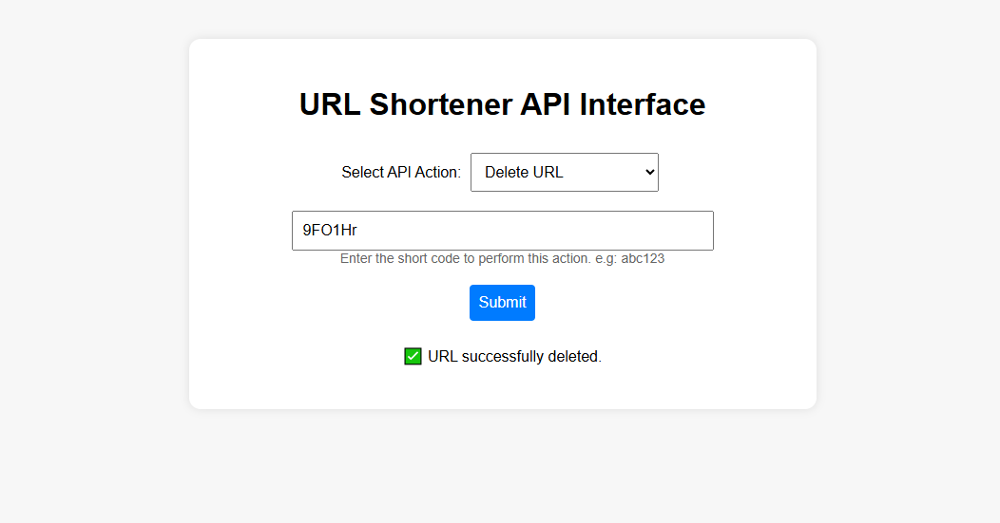
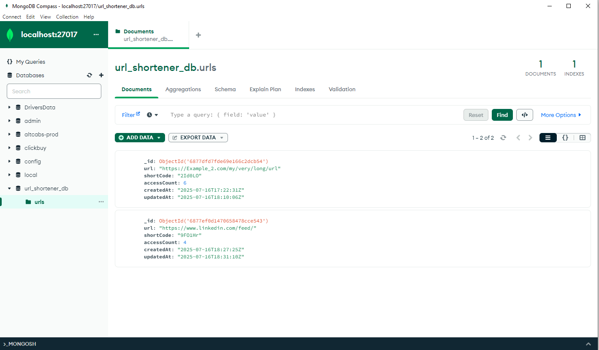

# hassan-innovaxel-abdullah
🔗 URL Shortener API + UI – Innovaxel Assignment

This is a complete URL shortening system built for the ASE - Python Specialist role at Innovaxel. It features a RESTful backend using Flask + MongoDB and an interactive single-page frontend built with HTML, CSS, and JavaScript.

⚙️ Tech Stack

- *Backend*: Python, Flask
- *Database*: MongoDB (`pymongo`)
- *Frontend*: HTML, CSS, Vanilla JS
- *Other*: dotenv, Fetch API

-----------------------------------------------------------------------------------

💡 Features

- 🔗 Shorten long URLs into 6-character codes
- 🧠 Retrieve original URL using shortCode
- 📊 Track access count and timestamps
- ✏️ Update shortCode’s target URL
- ❌ Delete shortCode from database
- 🖥️ Clean frontend UI for demo/testing:
  - Dropdown to select API action
  - Dynamic input fields
  - Result display (clickable URLs + copy buttons)
  - Redirect button for testing `/r/<shortCode>`

-----------------------------------------------------------------------------------

🔌 API Endpoints

| Method | Endpoint                       | Purpose                        |
|--------|--------------------------------|--------------------------------|
| POST   | `/shorten`                     | Shorten a long URL             |
| GET    | `/shorten/<shortCode>`         | Retrieve original URL          |
| GET    | `/shorten/<shortCode>/stats`   | View shortCode stats           |
| PUT    | `/shorten/<shortCode>`         | Update the URL for a shortCode |
| DELETE | `/shorten/<shortCode>`         | Delete a shortCode             |
| GET    | `/r/<shortCode>`               | Redirect to original URL       |

-----------------------------------------------------------------------------------

🧪 How to Run Locally

# 1. Clone and Setup

- git clone https://github.com/HassanAbdullahHere/hassan-innovaxel-abdullah.git
- cd hassan-innovaxel-abdullah
- python -m venv venv
- venv\Scripts\activate
- pip install -r requirements.txt

# 2. Set MongoDB Connection
Create a .env file in the root:

MONGO_URI=mongodb://localhost:27017/url_shortener_db

# 3. Run the Server

python app.py

*Then open your browser at:*
http://localhost:5000

## 📸 Demo Screenshots

### 🧾 1. UI Interface with Dropdown

### 🔗 2. Shorten URL Result

### 📥 3. Retrieve Original URL

### 📊 4. Get Stats for Short URL

### ✏️ 5. Update Short URL

### ❌ 6. Delete URL Confirmation

### 📂 7. MongoDB Data (Compass View)

